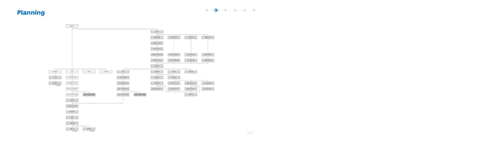
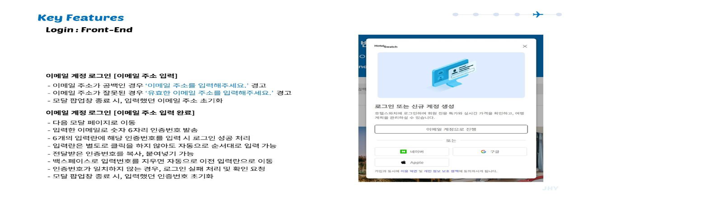
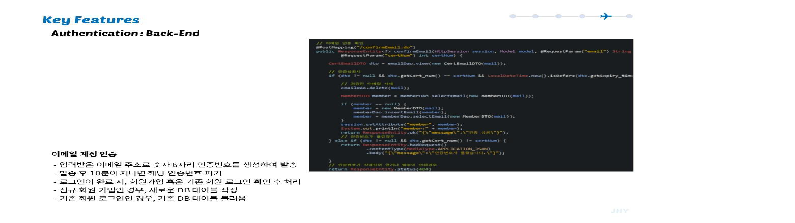
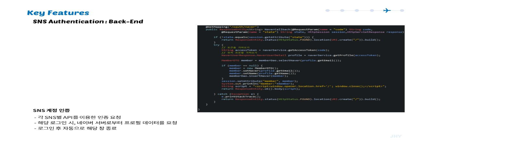
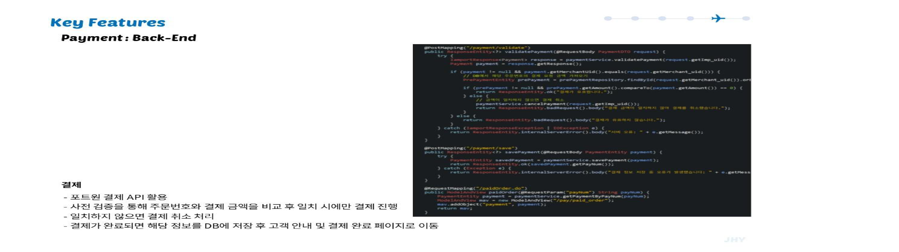
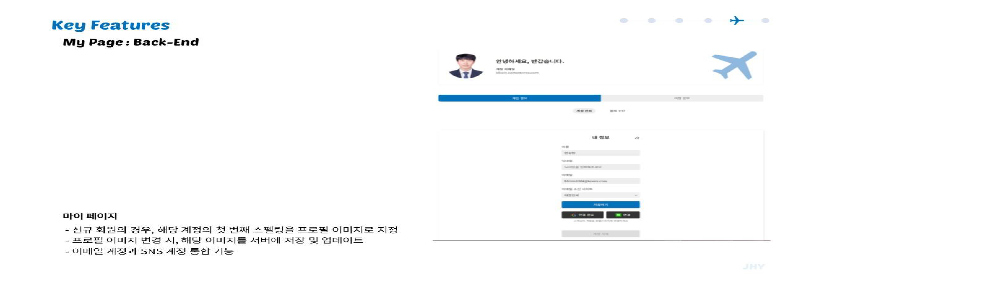

# 호텔스와치

## 1. 목표와 기능
### 1.1 목표 
여행객들이 여행을 계획할때 다양한 여행지의 수많은 숙소들을 간편하게 비교 후 최대한 싸게 이용할 수 있는 서비스를 제공

### 1.2 기능
- 숙소 검색 :숙소 예약 서비스의 DB 접근 서비스별 숙소 api/ 위치별 숙소 / 지도 api
- 숙소 비교 :숙소 별 최저가 비교 / 여행객들의 선호도 DB 수집
- 숙소 판매 : 서비스 최저가 대비 저렴하게 판매/ 서비스 수수료율 분석 / 서비스 내 직접 결제 / 결제 api

### 1.3 팀 구성

#### 팀원 소개
- [BE]안성현(로그인/결제/관리자 및 마이페이지/aws 서버 구현)
- [BE]김경태(호텔 검색/ 호텔,지도,후기 api 구현/ 게시판)
- [FE]유다연(검색결과 페이지/상세페이지/마이페이지/관리자페이지/ 로고디자인)
- [FE]윤진혁(총괄기획/메인페이지/검색결과 페이지/ 헤더/푸터/로그인/플러터 앱 개발

## 2. 개발 환경 및 배포 URL 
### 2.1 개발 환경 

#### 기술 스택
- Backend: Java 17, Spring Boot 3.x,JDBC,JPA
- Database: Oracle
- Cloud/Deploy: AWS EC2 
- API: 네이버 로그인,구글 SMTP
- Payment: PortOne

### 2.2 배포 URL
현재는 aws는 중지시켜 놓은 상태

## 3. 요구사항 명세와 기능 명세

## 4. 메인 기능
### 4-1. 체크인/ 체크 아웃
- 체크인 날짜는 기본으로 오늘날짜가 선택됨
- 체크아웃 날짜는 기본으로 내일 날짜가 선택됨
- 날짜 선택시 , 체크인 날짜는 오늘 이전의 날짜를 선택할 수 없음
- 체크 아웃 날짜는 체크인 날짜보다 하루이상 커야함

### 4-2. 검색기능

### 4-2. 지도기능

### 4-3. 후기

### 4-4. 이메일 계정 로그인

### 4-5. sns 계정 인증

### 4-5. 결제 포트원api

### 4-5. 마이페이지

